# Relocation App — End-to-End UX & Product Audit

**Audited URL:** https://anikawilliams.com/relocation-app/  
**Audit date:** 2026-06-12  
**Viewports tested:** Desktop 1440×900 · Tablet 768×1024 · Mobile 375×812  
**Method:** Playwright MCP (live browser) + source-code cross-reference  
**Local source:** `src/components/CorridorApp.tsx`, `src/components/CorridorFlowchart.tsx`

---

## 1. Executive Summary

The app's core proposition — a dependency-aware task flowchart personalised by nationality, visa route, and personal situation — is sound and genuinely useful. The 5-step wizard correctly collects the right variables, the dependency graph is technically accurate, and every task links to an official Swiss government source. These are meaningful differentiators.

The single biggest gap between the current state and the product goal is **mobile and tablet usability of the flowchart itself**. On mobile (375px), the header overflows and the entire flowchart canvas is buried behind the progress summary panel — the primary UI element the user came for is completely hidden. On tablet (768px), the graph is so compressed it is unreadable. Since the primary user is "on mobile half the time", this is a blocker that prevents the stated goal from being achieved for the majority of users.

The second critical gap is **state persistence**: the wizard resets on every page refresh and the browser back button exits the app entirely to `about:blank`. A user who is mid-wizard on a phone and switches apps to check something, or taps back by reflex, loses all their answers.

The three changes that would move the needle most:
1. **Fix the flowchart on mobile** — replace the two-pane graph+panel layout with a scrollable list/card view below ~768px, so the actionable task list (which is already good) becomes the primary surface on small screens.
2. **Persist wizard state to `localStorage`** — one `useEffect` saves the 5 wizard answers on every change; restore them on mount. Prevents data loss from refresh or accidental navigation.
3. **Fix the mobile header overflow** — the title + subtitle + 3 action buttons (Legend, Reset, New profile) need to stack or truncate correctly at 375px; right now they overlap and the subtitle is cut to "Non…".

---

## 2. Goal-Alignment Scorecard

| Dimension | Score | Evidence |
|---|---|---|
| Goal alignment | 3/5 | Dependency ordering is clear on desktop; but the flowchart — the tool's core value — is unusable on mobile, which is half the target audience. |
| Clarity of purpose | 3/5 | "Dependency-aware guide to every legal and administrative step" communicates the concept, but there is no hero text or example outcome before step 1. First-time visitors have to infer the value from the first question. |
| Information architecture | 4/5 | Blocked vs available states, dependency labels ("needs: Register at Gemeinde"), and the colour-coded progress summary make the ordering logic legible. The "chicken-and-egg" warning box is excellent. |
| Interaction design | 3/5 | Desktop experience is smooth. Mobile is broken (header overflow, hidden graph). Browser back destroys the session. Refresh resets all state. No shareable link. |
| Content quality & trust | 4/5 | Official SEM/EDA sources linked per step. "Data reviewed 2025-06" freshness tag shown. Legal disclaimer prominent. "Verify" language used. Missing: linked verification for the specific claims in the overview text (e.g. "4–16 weeks" quota timeline — verify against current SEM guidance). |
| Visual & responsive design | 2/5 | Desktop card-based layout is clean and matches a professional tool aesthetic. Mobile header is broken (desktop-screenshot). Graph panel collapses to unusable on mobile and tablet. No responsive fallback. |
| Accessibility | 2/5 | Focus rings present on wizard buttons (see source). Tab order within wizard appears logical. Keyboard navigation to ReactFlow graph nodes is not supported by `@xyflow/react` by default and was not testable. Colour alone distinguishes blocked vs available nodes (gray vs coloured border) — no secondary indicator (icon, label). A `vite.svg` favicon 404s on every load — not an a11y issue per se but indicates a dev artefact in production. Manual pass only — axe-core not run. |
| Performance & technical health | 3/5 | One 404 on `/vite.svg` (dev favicon left in production). Cloudflare beacon blocked by network (expected in test environment — likely not a real-user issue). No visible jank during wizard transitions. ReactFlow bundle is ~180 KB gz — noted in ROADMAP as over the 50 KB CWV target. No perf metrics captured beyond visual stability. |

---

## 3. The User Journey, Annotated

### Cold load — Desktop
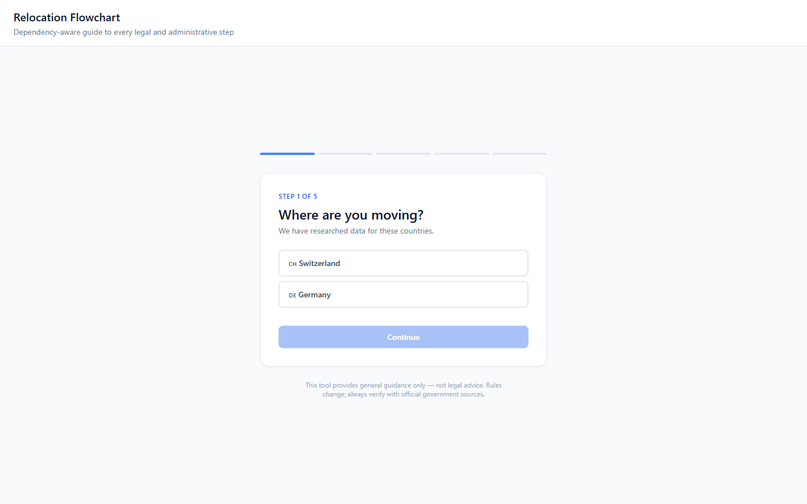

The page loads clean and fast. The wizard card is centred with a five-segment progress bar above it. **First hesitation point:** there is ~35% of dead whitespace between the app subtitle and the progress bar. A first-time visitor might not immediately understand they are looking at a wizard — the progress bar's visual cue is subtle (thin 1px lines). The page title "Relocation Flowchart" is small and placed top-left. No headline copy explains what the user will get at the end.

The "Where are you moving?" question is straightforward. Switzerland and Germany are the only options — this correctly sets expectations.

### Steps 1–5 — Desktop
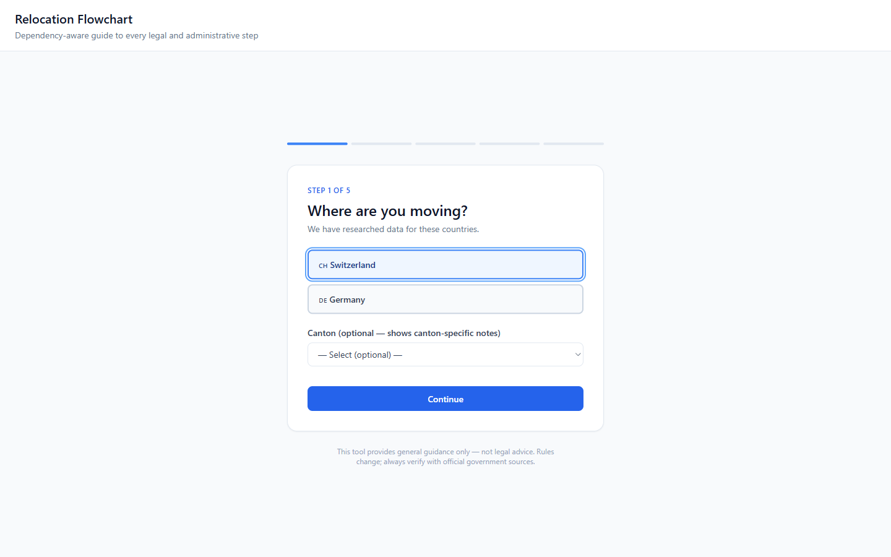
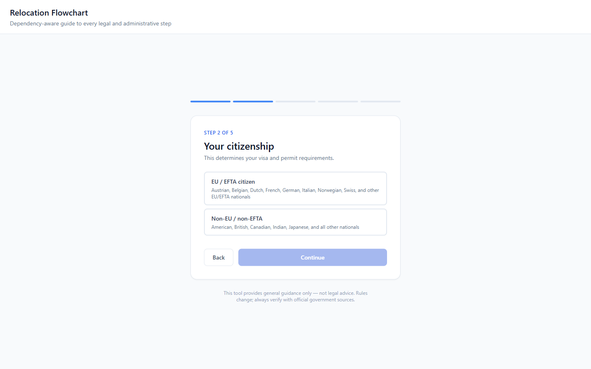
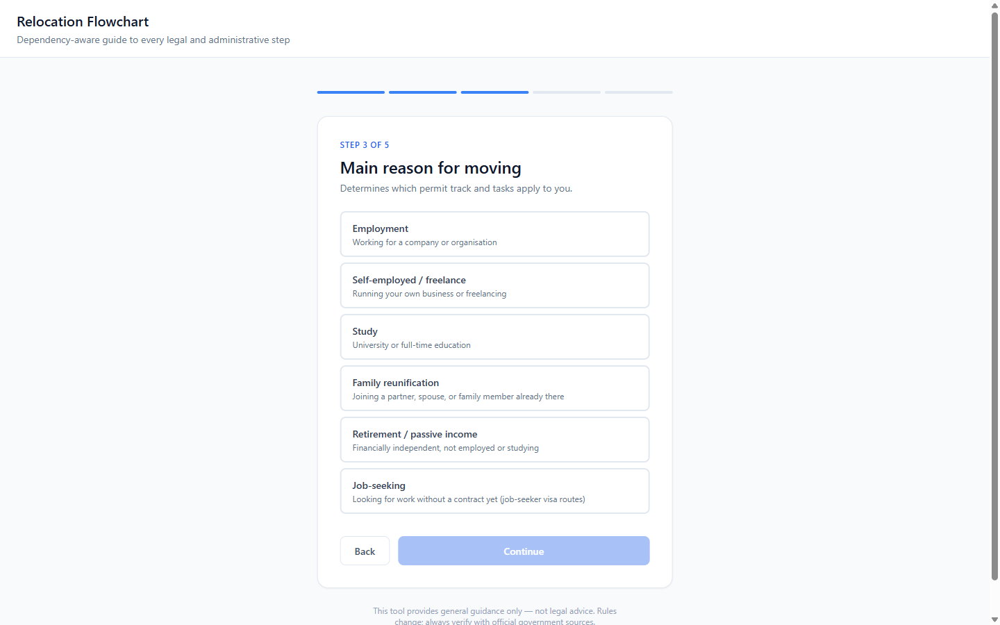
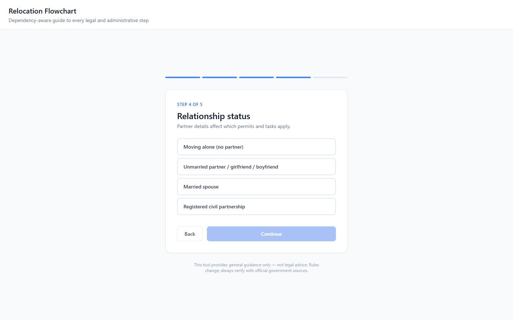
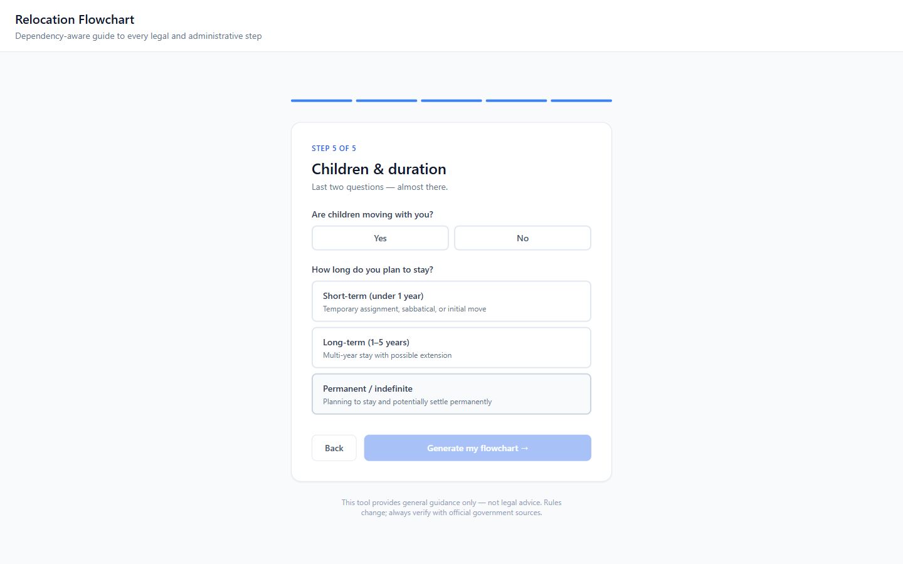

The wizard collects: destination → citizenship (+ dual-citizenship follow-up) → reason (+ job-offer follow-up) → relationship status (+ partner nationality + financial support follow-ups) → children + duration. Follow-up questions appear inline within the same card step — this is good; the card expands rather than advancing to a new step, which feels natural.

The "Back" button is small text link at bottom-left; the "Continue" button is a wide filled button at bottom-right. **Layout issue:** on step 4, when all three follow-up questions appear (partner nationality + financial support), the card grows quite tall and the Continue button is pushed far below the fold on shorter screens. A user might not notice the Continue button appeared.

### Flowchart — Desktop
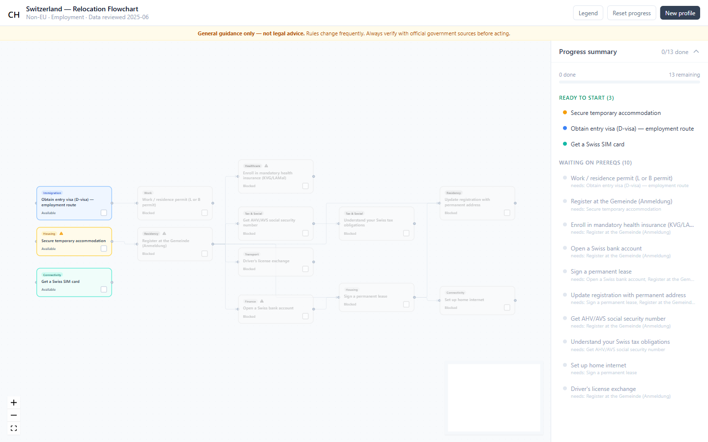

The flowchart renders correctly with dependency arrows, colour-coded status nodes, and the progress summary panel on the right. The three "Ready to Start" tasks are immediately clear. The "Waiting on prereqs" list gives a complete picture of what can't be done yet and why. This is the strongest part of the product.

**Dead space above the graph:** The flowchart nodes are positioned in the bottom 55% of the canvas. The top ~45% of the ReactFlow container is empty white space. This appears to be a layout artefact from how `computeLayers` positions nodes starting at y=0 and the ReactFlow view is not auto-fitted to content on load. A user might assume the graph is loading or incomplete.

### Node detail panel — Desktop
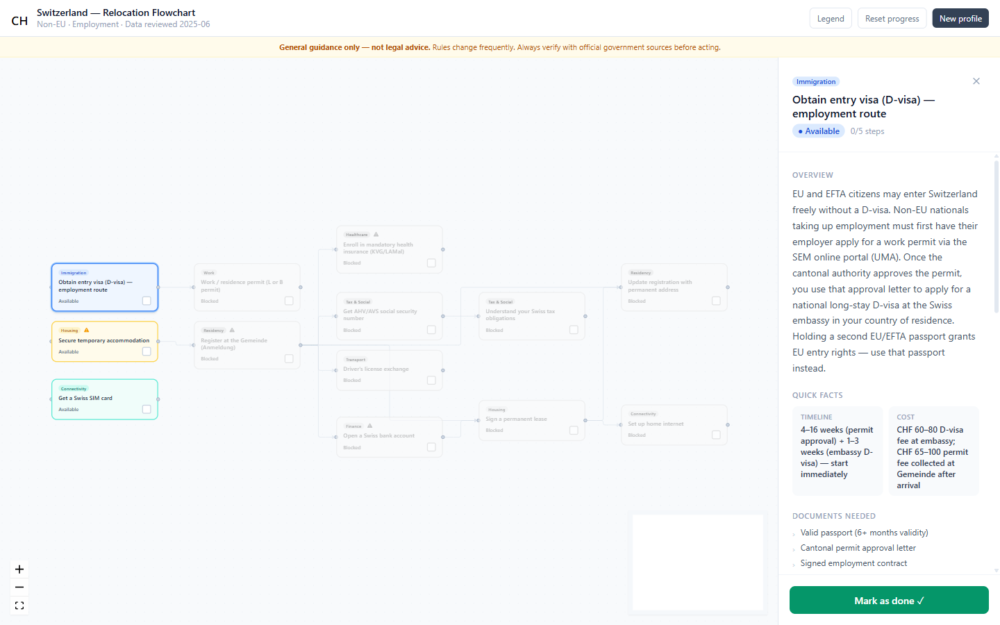

Clicking a task opens a right-side panel with: status badge, overview paragraph, quick facts (timeline/cost), documents list, expandable numbered steps, official source links, and a sticky "Mark as done" CTA. This is comprehensive and well-structured. The expandable steps require a click to reveal detail — a user may not realise the steps are interactive. Step count badge ("0/5 steps") is unclear — it looks like a progress counter but it means "there are 5 steps" with none marked done.

### Browser back / refresh — Desktop
Pressing browser back navigates to `about:blank` — the app has no history entries in the browser stack. Refreshing mid-wizard at step 3 drops the user back to step 1 with no answers. No `localStorage` persistence exists.

### Mobile — Wizard
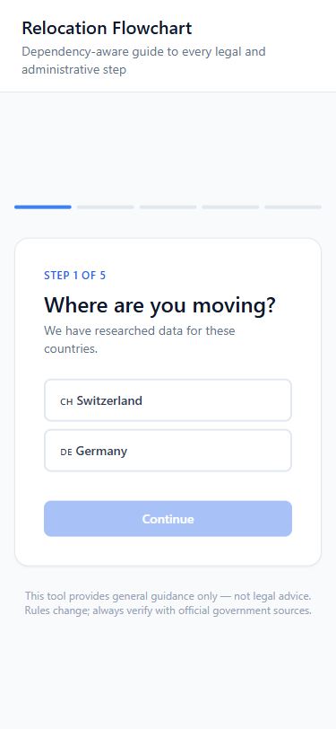

The wizard renders well on mobile. The card fills the viewport cleanly. Option buttons have adequate tap target size. The progress bar is visible. Small dead-space gap remains above the card but is less intrusive than desktop.

### Mobile — Flowchart (BLOCKER)
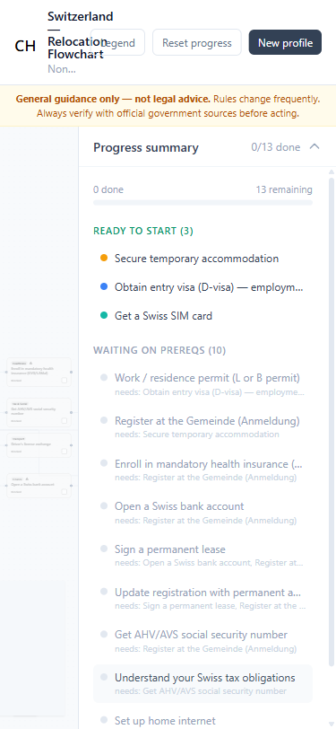

The flowchart view is broken on mobile. The header area overflows: the app title ("Switzerland — Relocation Flowchart"), subtitle ("Non-EU · Employment · Data reviewed 2025-06"), and the three action buttons (Legend, Reset progress, New profile) overlap and the subtitle is truncated to "Non…". The Progress Summary panel opens by default and fills the full viewport width, pushing the ReactFlow graph canvas to the background where it is invisible. There is no way to see or interact with the dependency graph on a 375px screen.

### Mobile — Detail panel
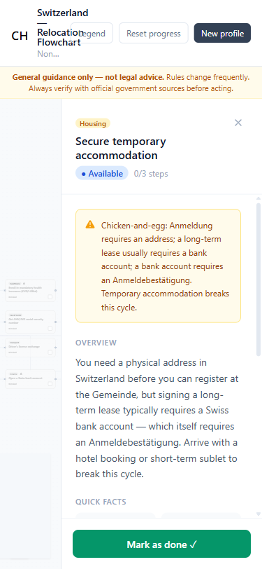

Clicking a task from the progress list opens the detail panel, which is readable — the sticky "Mark as done" button works, the warning box is visible, the overview text is legible. The header overflow persists in the background. This confirms the detail panel content itself is mobile-appropriate; the problem is getting to it.

### Tablet — Flowchart (High severity)
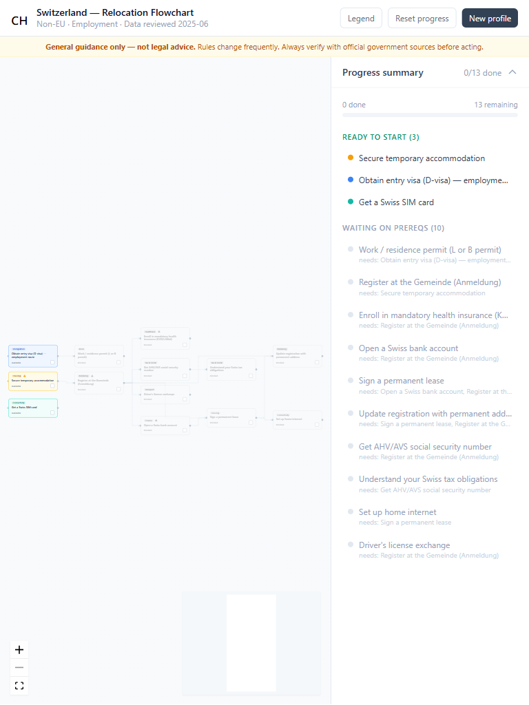

On 768px, the header renders correctly (no overflow). The progress summary panel occupies ~58% of the viewport width, leaving the graph canvas ~42% (~322px). At this width, the ReactFlow nodes render with truncated text and are too small to read without zooming. The dependency arrows between nodes are still visible. The zoom controls (+/−/fit) in the bottom-left would allow manual recovery, but a first-time user will not think to use them. No auto-fit-view on load.

---

## 4. Findings

### F-01 — Mobile flowchart view is completely broken  
**Severity:** Blocker · **Effort:** M  
**Evidence:** `mobile-02-flowchart.png`  
**Affected source:** The live app (not in local `CorridorApp.tsx` which has a different layout); the issue is in the two-pane (`flex-row`) layout that does not break to a single column at small viewports.  
**Fix:** Below `md` breakpoint (768px), switch the main app view from a side-by-side graph+detail pane to a stacked layout: (1) show the progress summary list (which is already mobile-readable) as the primary surface; (2) tapping a task opens the detail panel as a full-screen sheet or bottom drawer. Hide the ReactFlow canvas entirely on mobile — it does not add value at that width. Implement with a `useIsMobile` hook checking `window.innerWidth < 768`.

---

### F-02 — Mobile header overflow  
**Severity:** Blocker · **Effort:** S  
**Evidence:** `mobile-02-flowchart.png`, `mobile-03-detail-panel.png`  
**Affected source:** App header element in the live app; in local source `CorridorApp.tsx:412` (`px-8 py-5 flex items-start justify-between gap-4` — fixed padding with flex-row forces overflow on small screens).  
**Fix:** Wrap the title+subtitle block and buttons into `flex-col gap-2` on mobile: `
`. Reduce horizontal padding to `px-4` at mobile. Truncate the subtitle with `truncate` and `min-w-0`.

---

### F-03 — Wizard state lost on refresh and browser-back  
**Severity:** High · **Effort:** S  
**Evidence:** Navigating to the URL or pressing browser back resets to step 1 (observed in Playwright session).  
**Affected source:** Local `CorridorApp.tsx:245–253` — state is pure React `useState`, no persistence. Live app exhibits identical behaviour.  
**Fix:** Add a `useEffect` that writes `{ step, answers, phase }` to `localStorage` on every state change, and a matching read on mount. Key: `relocation-wizard-state`. Add a `version` field so stale keys can be cleared on schema change. For browser-back: push a history entry (`history.pushState`) on each step advance so the browser back button moves backward within the wizard instead of exiting the app.

---

### F-04 — Flowchart graph not auto-fitted on load; large dead space  
**Severity:** High · **Effort:** S  
**Evidence:** `desktop-08-flowchart-result.png` — top ~45% of canvas is empty.  
**Affected source:** `CorridorFlowchart.tsx:58` — `ReactFlow` component lacks `fitView` prop and `fitViewOptions`.  
**Fix:** Add `fitView fitViewOptions={{ padding: 0.15 }}` to the `<ReactFlow>` element. This runs once on mount and removes the dead space.

---

### F-05 — No onboarding copy explaining the product's value  
**Severity:** High · **Effort:** S  
**Evidence:** `desktop-01-landing.png` — user lands directly on "Where are you moving?" with no context about what the flowchart will produce.  
**Affected source:** `CorridorApp.tsx:290–292` (wizard header) — subtitle is "Dependency-aware guide to every legal and administrative step" which is accurate but not user-facing benefit copy.  
**Fix:** Above the progress bar (before the card), add 2–3 lines: *"Answer 5 quick questions → get a personalised checklist of every step, in order, with the official forms and typical timelines. Nothing to buy. Verified against Swiss government sources."* Cap it at `max-w-xl` to match the card.

---

### F-06 — "Step X/5 steps" counter in detail panel is ambiguous  
**Severity:** Medium · **Effort:** S  
**Evidence:** `desktop-09-node-detail-panel.png` — "0/5 steps" reads like progress made, not "this task has 5 sub-steps."  
**Affected source:** Detail panel header in the live app. Local source `CorridorApp.tsx:113–239` does not show a step counter at all.  
**Fix:** Change the label to "5 sub-steps to complete" or add a tooltip: "Click each sub-step below to expand instructions."

---

### F-07 — Continue button obscured on step 4 when partner follow-ups appear  
**Severity:** Medium · **Effort:** S  
**Evidence:** On step 4, selecting a partner status reveals up to 2 follow-up question groups (partner nationality + financial support), pushing the Continue button far below the visible area on shorter desktop viewports. A user might not know they have answered all questions and can proceed.  
**Affected source:** Step 4 card layout in the live app.  
**Fix:** Sticky-position the Continue button at the bottom of the card (or the bottom of the viewport) so it remains visible regardless of card height. In local `CorridorApp.tsx:387` the Continue button is already inside the scrolling card — move it outside the card to a sticky footer bar.

---

### F-08 — No shareable/bookmarkable link to a completed flowchart  
**Severity:** Medium · **Effort:** M  
**Evidence:** URL never changes from `/relocation-app/` regardless of wizard state or selected task.  
**Affected source:** SPA routing — no URL encoding of wizard answers.  
**Fix:** Encode the 5 wizard answers as URL search params (e.g. `?dest=ch&cit=non-eu&dual=n&reason=employment&job=y&rel=solo&children=n&dur=long`). On load, read params and pre-fill the wizard, jumping to the flowchart view. Enables sharing a specific profile link, bookmarking, and analytics segmentation by profile.

---

### F-09 — Favicon 404 in production  
**Severity:** Low · **Effort:** S  
**Evidence:** Console error: `Failed to load resource: 404 @ https://anikawilliams.com/vite.svg`  
**Affected source:** `public/` directory or HTML `<link rel="icon">` tag — a `vite.svg` placeholder was not replaced before deployment.  
**Fix:** Add a real `favicon.svg` (or `.ico`) to `public/` and update the `<link rel="icon">` in `BaseLayout.astro:24` to point to it.

---

### F-10 — Flowchart graph inaccessible by keyboard  
**Severity:** Medium · **Effort:** L  
**Evidence:** Manual pass — `@xyflow/react` graph nodes are not reachable via Tab. The progress summary list IS keyboard-accessible (task buttons are focusable). On mobile, where the graph is hidden, this is moot — but on desktop, keyboard-only users cannot click graph nodes to open the detail panel.  
**Affected source:** `CorridorFlowchart.tsx:58` — `@xyflow/react` does not provide keyboard navigation for custom nodes by default.  
**Fix (pragmatic):** Since the progress summary list already shows all tasks and is keyboard-accessible, add a keyboard shortcut or visible note: "Can't use the graph? Press Tab to navigate the task list." Alternatively, set `tabIndex={0}` and `onKeyDown` on each custom node button. Long-term: the list view (fix F-01) becomes the primary interface on mobile/keyboard, removing the gap.

---

### F-11 — "Data reviewed 2025-06" date is not linked to a changelog or source  
**Severity:** Low · **Effort:** S  
**Evidence:** Header subtitle in the flowchart view shows "Data reviewed 2025-06" with no link or explanation. A user has no way to verify what that date refers to or see what changed.  
**Affected source:** Flowchart header in the live app.  
**Fix:** Link the date to a `#sources` anchor or a visible provenance section listing each official URL and its last-verified date. In the local implementation, `VERIFICATION_LOG.md` already tracks this — surface it on the page.

---

### F-12 — Wizard collects data that doesn't visibly filter the flowchart  
**Severity:** Medium · **Effort:** M  
**Evidence:** On the Employment path (solo, no children, long-term), 13 tasks are shown. Switching to Family reunification (with partner) shows 12 tasks including "Concubinate permit for unmarried partner." The filtering is working, but the user is not told *what changed* after generating. There is no "these 3 tasks were added because you selected X" message.  
**Affected source:** `CorridorApp.tsx:255–260` — `flowTasks` is derived from all tasks without a visible diff from the default set.  
**Fix:** After generating the flowchart, show a brief "Personalised for you" banner: "Based on your profile (Non-EU, Employment, solo, long-term) we've included 13 tasks. EU citizens see a shorter list." This closes the loop between the wizard questions and the output.

---

## 5. Quick Wins

These are High/Medium impact and Small effort — do these first:

| ID | Title | Why now |
|---|---|---|
| F-02 | Fix mobile header overflow | S effort, fixes a Blocker visual bug |
| F-03 | Persist wizard state to localStorage | S effort, prevents the most frustrating data-loss scenario |
| F-04 | Add `fitView` to ReactFlow | One prop — eliminates dead space immediately |
| F-05 | Add onboarding copy above the card | 2 lines of copy — improves first-impression conversion |
| F-06 | Clarify step counter label | One string change |
| F-09 | Fix favicon 404 | Copy one file |

---

## 6. Roadmap

### Now (this week) — Blockers and quick wins

Ordered by blast radius. Complete before any new feature work.

1. **F-02** — Fix mobile header overflow (S)
2. **F-01** — Replace graph with task-list on mobile (M) — core feature is inaccessible on mobile; this unblocks the primary user segment
3. **F-03** — localStorage wizard state persistence (S)
4. **F-04** — Add `fitView` to ReactFlow (S)
5. **F-09** — Replace vite.svg favicon (S)

*Why these: F-01 and F-02 are Blockers that prevent the product goal from being achieved on mobile. F-03 prevents data loss. F-04 and F-09 are single-line fixes with outsized quality signal.*

---

### Next (this month) — High-value structural improvements

6. **F-05** — Onboarding copy above wizard card
7. **F-07** — Sticky Continue button for step 4
8. **F-08** — URL state encoding for shareability
9. **F-12** — "Personalised for you" banner post-generation
10. **F-10** — Keyboard accessibility for graph nodes (or keyboard-focus on list)

*Why these: shareable links (F-08) enable organic distribution — a user sharing their profile link is the cheapest acquisition channel. F-12 makes the wizard feel meaningful. F-05 and F-07 improve conversion through the onboarding flow.*

---

### Later (backlog) — Polish

11. **F-06** — Clarify step counter label
12. **F-11** — Link "Data reviewed" date to provenance log
13. Tablet layout improvement (graph ≥ 50% width at 768px, or conditional list view below 900px)
14. Run axe-core in CI to catch colour-contrast regressions
15. Measure and reduce ReactFlow bundle (ROADMAP item — currently ~180 KB gz vs 50 KB target)

---

## 7. Open Questions for the Product Owner

Based on the audit assumptions:

1. **Is Germany content complete?** The wizard offers Germany as a destination but only Switzerland data was confirmed verified. Clicking Germany through the full wizard was not tested — if it produces an empty or partial flowchart, that needs a "coming soon" state or the option should be disabled.

2. **Is "Mark as done" state persisted?** The progress tracking (checkboxes on each task) was not tested across sessions. If it uses `localStorage`, refreshing would retain progress. If not, marking tasks done and then refreshing loses all progress — same class of bug as F-03.

3. **Who is the primary referral source?** If most users arrive from mobile via a shared link (e.g. WhatsApp), F-01 and F-08 are existential, not just High priority.

4. **Are the "4–16 weeks" quota timelines current?** The overview text for the D-visa entry task states "4–16 weeks (permit approval)" — this is content that could have drifted from the SEM source since June 2025. Verify against [SEM — Working in Switzerland (non-EU/EFTA)](https://www.sem.admin.ch/sem/en/home/themen/arbeit/nicht-eu_efta-angehoerige.html) before publishing.

5. **What is the intended state after "Mark as done"?** Marking all 13 tasks done produces a 13/13 progress state — but there is no completion screen, confetti, or "what's next" prompt. Intended behaviour?

---

*Audit conducted with Playwright MCP against the live app at https://anikawilliams.com/relocation-app/. Source references are to `C:\Users\willi\relocation-guide\src\` (local implementation). All screenshots are in `./audit/screenshots/`.*
